# Computer Vision Based CCTV Accident Detection  

### Introduction
Every year, road accidents claim the lives of 1.3 million people, with over 50 million people suffering injuries that are non fatal. The repercussions of these accidents extend far beyond the loss of lives, costing most countries upto 3% of their Gross Domestic Product.  

One of the reasons for the high fatalities of these accidents is the lack of timely medical attention given to the victims. The total time taken for this first aid to reach the victim can be divided into two segments, T1 and T2.  
  

T1 is the time between the accident occurring and it being reported to the nearest emergency center or hospital. This is the segment that has the most variation, as for an accident to be reported, there must be someone present at the scene of the accident to manually inform the center that the accident had occurred. Certain modern car models are fitted with sensor arrays and systems that report these accidents, but the vast majority of vehicles across the country and the world are not equipped with these services.  

T2 is the time between the accident being reported and the medical aid reaching the victim. This segment is more controlled, with efficient systems in place that dispatches medical aid quickly. The only hurdles faced in this segment are the ones that cannot be controlled, such as weather conditions, road traffic and so on.  

The sum total of both these segments should be under an hour, in order for the victim to have the best possible chances of survival. The segment with the best chance of improvement is the time taken for the accident to be reported or T1. Our goal is to minimize this, by automatically detecting accidents through the CCTV camera network that already exists, and allowing emergency care centers to instantly dispatch medical aid. This gives the victim the best possible chance to receive care in the golden hour, maximizing their chances of survival.  

### Proposed Solution  
Combining the various editing methods, we propose a solution that not only makes use of Deep Learning based feature extraction but also takes into consideration the locality of the occurred accident in terms of the entire frame by leveraging state of the art Object Detection methodologies combined with a custom collision detection algorithm. The approach to accident detection can be classified into two separate stages.  
• Detection of Vehicles involved in an accident via object detection and a collision algorithm  
• Classification of the detected accident by the use of two separate CNN and ANN models.  
  – Google’s Densenet-201 for primary feature extraction.  
  – A fully connected multi layer neural network.  

#### Step 1: Object Detection using YOLOv4  
YOLO is an algorithm that provides real-time object detection using neural networks. The popularity of this algorithm is due to its accuracy and quickness. It has been applied in a variety of ways to identify objects such as people, animals and vehicles. Various methods are used for object identification, including Retina-Net, fast R-CNN, and Single-Shot MultiBox Detector (SSD). These methods have addressed the problems of data scarcity and modelling in object detection, however they cannot find objects in a single algorithm run. Due to its better performance over the aforementioned object identification approaches, the YOLO algorithm has grown in popularity.  
  
YOLO works in real-time depending on the hardware used to run it. It takes in an input image and produces an output bounding box which consists of the coordinates in two dimensional space with respect to an image. In our particular use-case, we made use of YOLOv4 which has better accuracy and efficiency when compared to it’s predecessors. We made use of the pretrained YOLOv4 model and further trained on 10000 images of cars with their bounding box annotated.  
  

#### Step 2: Collision Detection  
After we detect the vehicles in the frame, we move onto the collision detection step. Our intention is to localise the region where an accident might have happened, instead of attempting to detect the accident on an entire frame. The algorithm designed for the same is based on the Axis Aligned Bounding Box(AABB), where the edges of the box are parallel to the Cartesian coordinate axes. We take the bounding boxes of the detected vehicles and their coordinates as used by OpenCV where the origin of the image is located at the upper-left hand corner. We then take the horizontal and vertical distances between the centres of the two detected bounding boxes, and subtract the half widths and half heights of the boxes from them respectively to determine if the boxes overlap. If the resultant value is negative in both cases, we can confirm that the boxes overlap, and there might be an accident.  

To counter an irregularity in the object detection process where two vehicles, on impact, are detected as a single object as seen in the figure below, we check if the resultant values are less than 5% of the half width and height, to allow the algorithm to shortlist cases where the vehicles are about to collide. As this algorithm only involves checking ranges of coordinate values, it is computationally less intensive than other approaches such as Intersection over Union, and this also allows us to quickly eliminate objects that are far apart in the frame, allowing us to process situations with multiple objects in the frame quickly.  
  

#### Step 3: Feature Extraction using Densenet-201 and Classification  
After we detect a possible accident using the collision detection algorithm, we crop the region of the image where the collision was detected and is sent to a classifier that predicts the probability that an accident has occurred in that region. By doing so, we minimise cases where cars pass close by each other but do not necessarily collide.  

DenseNet-201 is a Convolutional Neural Network that has 201 layers where each layer obtains inputs from all preceding layers and passes its own feature maps to the subsequent layers where it focuses on concatenating the outputs from the previous layers instead of using a summation. Since each layer receives feature maps from the preceding layers, the network can be thinner and more compact. This helps achieve higher computational and memory efficiency.  
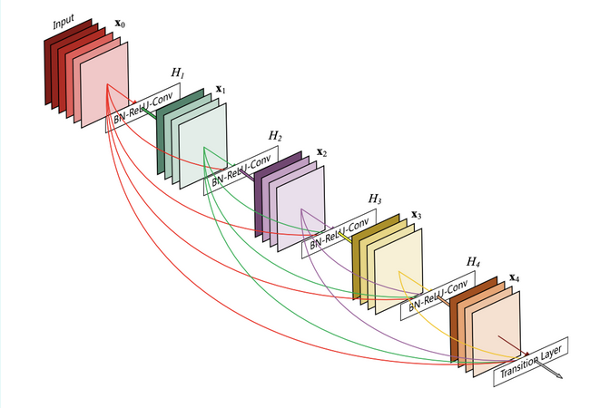  

Feature extraction being performed by the Densenet-201 model produces a feature vector of shape (1,1920) which on flattening gives a vector of (1920,). Each image is resized to 224x224x3 pixels which is then resized to (1,224,224,3) which is the input format required by Densenet-201.  
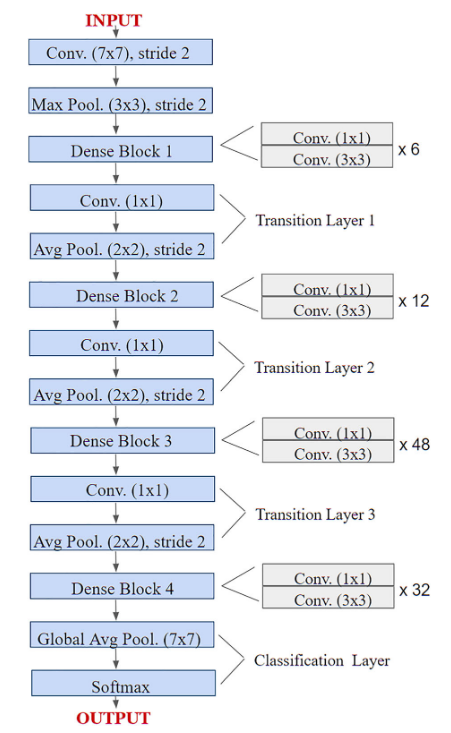  

After the extraction of features, these features are then fed to an Artificial Neural Network which then handles the task of accident classification. The output of the Densenet-201 model produces a vector of length 1920 which
basically contains the required features of the input image.This (1920,1) dimension vector is fed to a Neural Network with an input layer od 16 neurons, followed by two hidden layers of 32 and 16 neurons each and a final output
layer.  
  
Between each layer, there exists a dropout layer to prevent over-fitting, a Rectified Linear Unit (ReLU) and a Sigmoid activation function between the last hidden layer and the output layer. Having a single output neuron would allow for the specification for minimising false positive cases. In our case we set the threshold to be 0.82, this causes all of the accidents with probability 0.82 to be classified as an accident.  

### System Block Diagram  
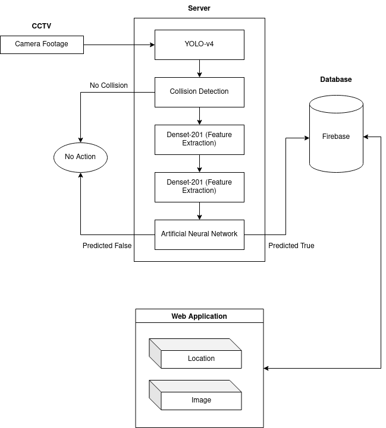  

### Dataset  
The dataset contains 5000 images divided into two classes: Accidents and Non-Accidents.   
  
The Accident class is made up of 2500 images of various types and angles of accidents. This data was extracted from CCTV Video footage uploaded to Youtube along with Google image results. We experimented with simulated footage using Beam.NG, an extremely detailed and authentic vehicle simulation software. However, we felt that the simulated footage was not photo-realistic enough and did not complement the existing dataset well, so we
chose to not use it. We also manually cleaned the Accident class, and removed images that did not belong to the class or was not good enough to be a part of the dataset.  
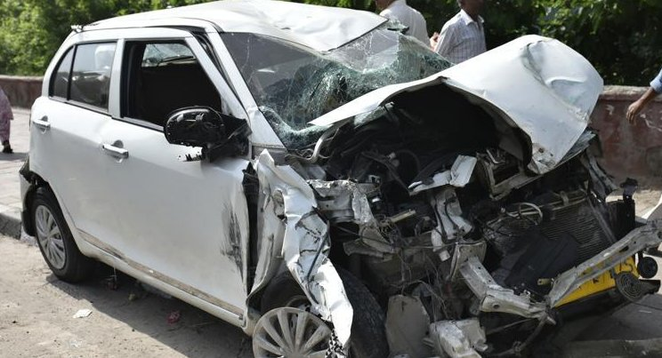  
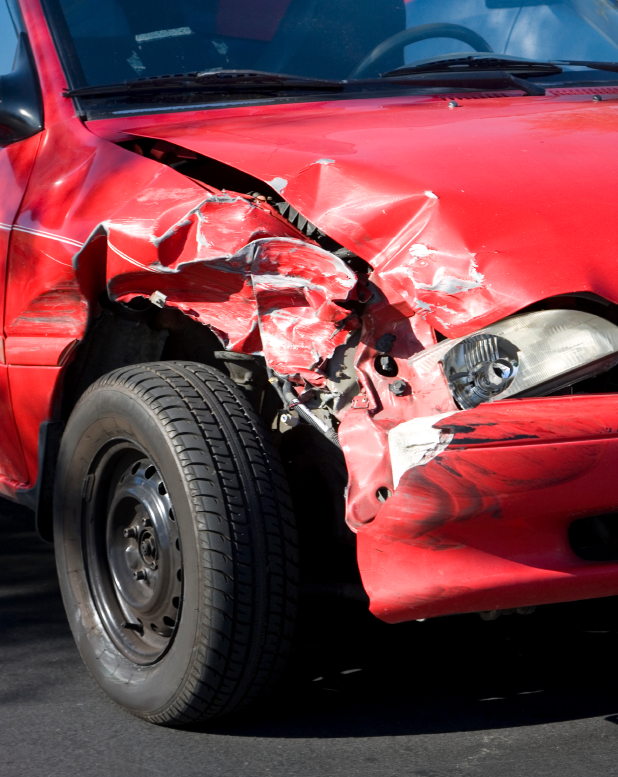  
  

The Non-Accident class is also made up of 2500 images, and mainly consists of various situations where vehicles are close to each other, and might appear to collide but are not. This class is crucial as it helps the model differentiate between cases where vehicles have actually collided and cases where the vehicles are close to each other but have not collided. This class ensures that the false positive alerts raised are kept in check.  
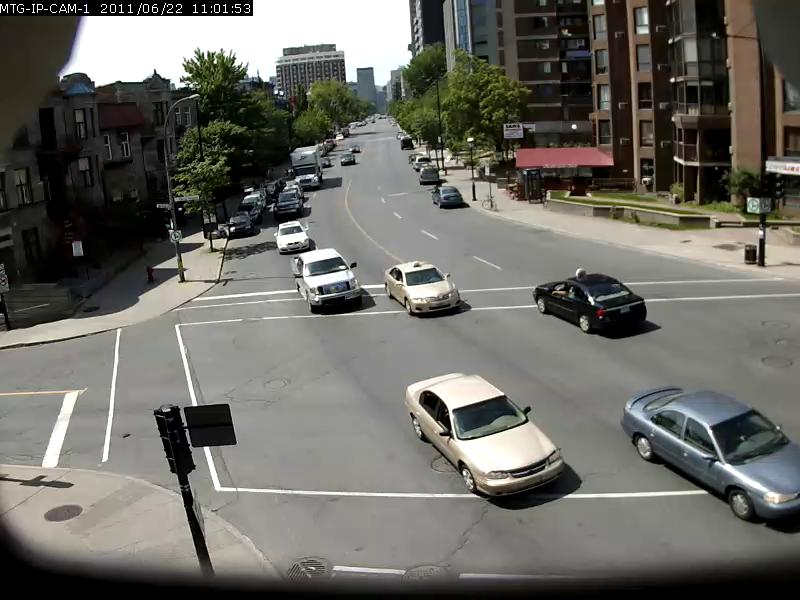  
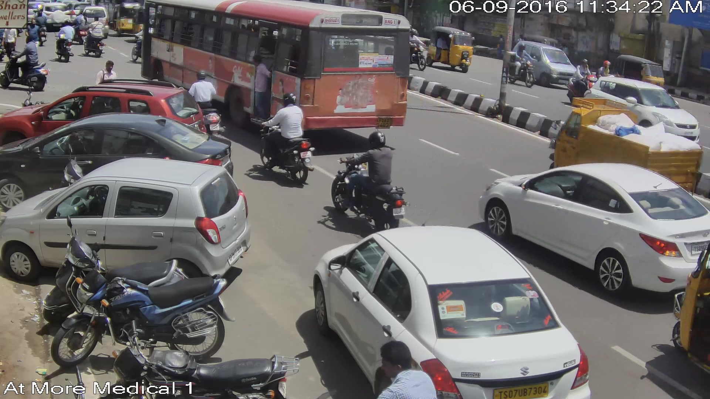  
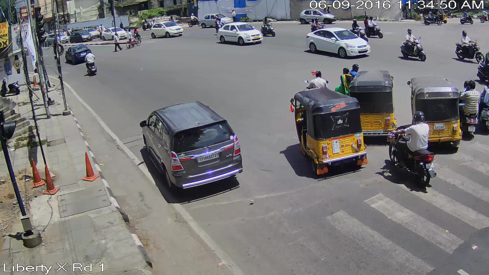  

### Testing  
For the end-to-end testing process, we utilized a test video set of 10 videos, captured in varied conditions. These videos were not included in the training dataset, to ensure the most accurate testing scenarios.  
  
The Deep Learning model’s performance was tested based on our dataset. The dataset was split into train, test and evaluation data at 60% for training, 20% for testing and and the remaining 20% for evaluation of the models performance. This testing resulted in an accuracy of 97% of the deep learning models in classification of accident images vs non-accident images.  

The images below show a few test videos where the system was correctly able to identify the collision and predict the accident across different conditions.  
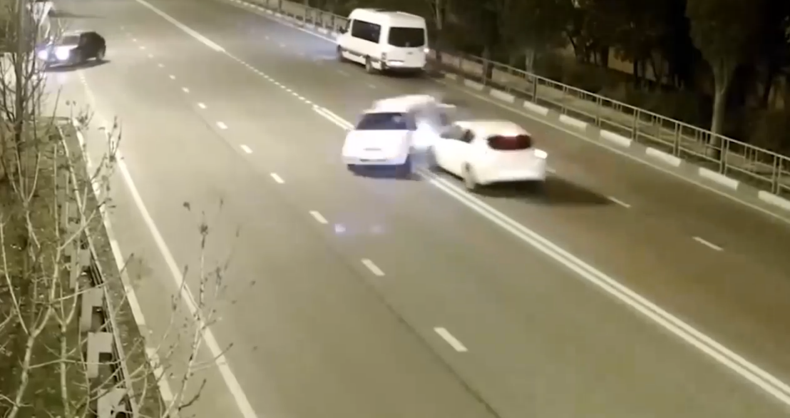  
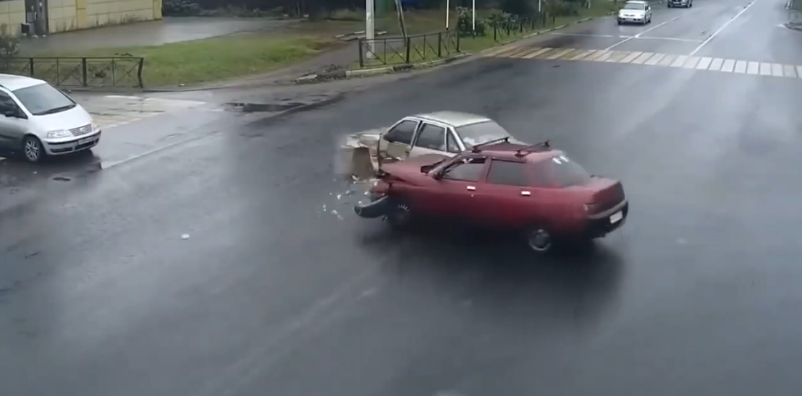  
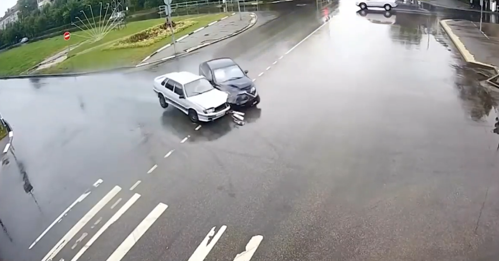  

After the testing process, our model was able to correctly identify accidents in 9 out of 10 accident videos, giving us an accuracy of 90%. Another tool used for testing the performance of the model was Beam.NG, an accurate physics based vehicle simulator. We simulated accidents, and used the captured footage to test the model as seen in the figures below. Although the simulations showed promise, it was not graphically realistic enough for our use-case, so we chose not to include the captured videos in the testing process.  
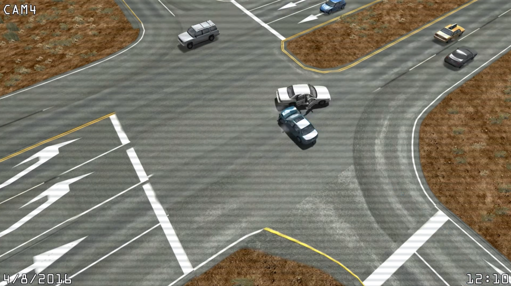  
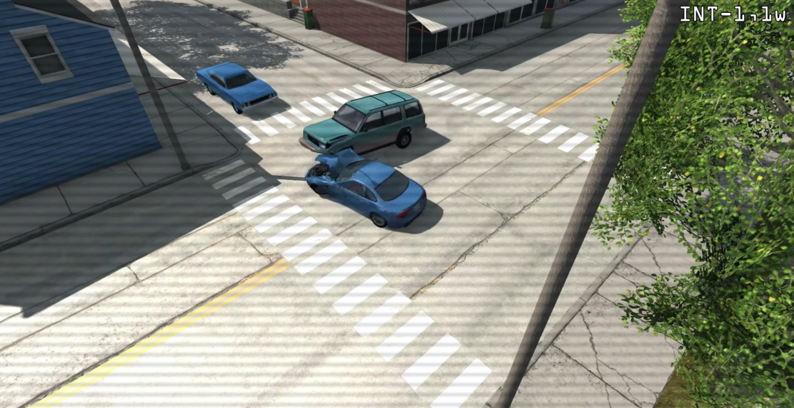  

To test for false positives, we used a looped video as seen in the figure below. These videos show vehicles in close proximity to each other, at different angles. Our model was able to process the entire video without raising any accidents, showcasing its ability to reject potential false positive results, improving the overall reliability of the system.  
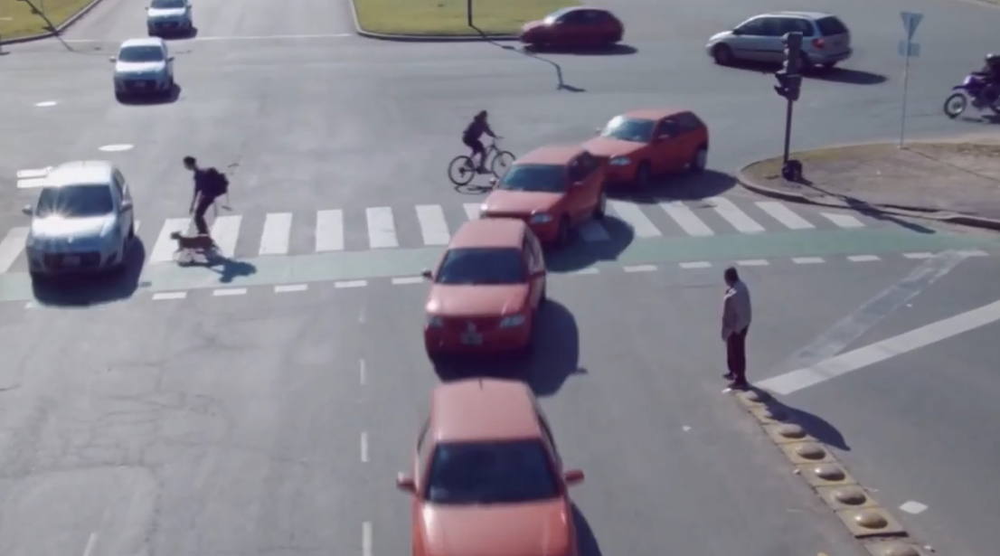  

To test for the latency or the time taken for the accident to be detected and reported, testing was performed on a machine with 8 Gigabytes of Video Memory and 16 Gigabytes Random Access Memory. This testing setup resulted in near real-time results with an average of 45 frames per second.  

### Experimentation  
Extensive experimentation was carried out when working with this particular 2 stage accident detection system. When approaching the problem of object detection, various models were experimented with to compare and contrast between their accuracy and efficiency. In terms of object detection as a whole, Single Stage detectors outperform all other methods of object detection and YOLO-v4 seems to outperform any other single stage detector. Within yolo itself, there exist variations of the model for further fine tuning of accuracy and efficiency but the base YOLOv4 seemed to have a good balance between both of the metrics and we proceeded with this instead.  
  
Collision Detection is a significant part of accident detection and we needed to ensure that the algorithm we chose would not lead to multiple false positives. As mentioned earlier, we made use of a variation of the Axis Aligned Bounding Box (AABB) method instead of the standard Intersection over Union (IOU) method. The reason for this is due to the relative position of the accident with respect to the CCTV camera footage. In the case where the accident is a distance away from the camera, the IOU method fails to take into consideration the actual percentage of overlap whereas the AABB method handles this effectively.  

In the second stage of the system, from the view point of feature extraction, various methodologies such as Histogram of Gradients (HOG) and Canny edge detection. Older methods such as edge detection seemed to provide average results due it the edge detection being dependent on the surroundings of the accident, although many features of a car crash isn’t brought to context by Canny edge detection, it does extract useful information from the image and provide reasonable accuracy. Other feature detection algorithms such as Speeded Up Robust Features, Scale-Invariant feature transform have been tested with similar images and have been found to perform poorly in comparison to CNNs. We make use of F1 score as a metric used for comparison. Accuracy is used when the True positives and true negatives are important whereas f1 score also takes into account the false positives and false negatives. In our use case, false negatives are to be minimised as every accident should be identified. As mentioned earlier, we make use of a CNN for feature extraction combined with an ANN for classification. Experimentation was done with various models such as Resnet-50, Densenet, Inception-v3 and VGG16 all with a threshold probability score of 0.6.  
  
When coming to the ANN that was used for classification, it consists of 3 hidden layers as shown in (link figure). The layers consist of 8, 32, and 16 neutrons respectively. In between each layer, there exists a dropout layer to prevent overfitting and a ReLU activation function as well. The final output layer consists of a single output neuron with a sigmoid activation function. The model was trained with a binary crosentrpoy loss and the Adam optimizer with a learning rate of 0.001 for 30 epochs and a batch size of 512 images.  

### Results  
We evaluated the data against 20% of the original dataset as evaluation data and the results are as shown in the table.  
  
| CNN Architecture | F1-Score (N) |
|------------------|--------------|
| Resnet-50        | 0.95         |
| Densenet-201     | 0.97         |
| Inception-v3     | 0.94         |
| VGG16            | 0.93         |
|------------------|--------------|  

From the results we see that the Densenet-201 architecture performs significantly better than the other CNNs for feature extraction, in the case of the end to end system, we trained the model on all of the images from our dataset and tested it on videos of accidents.  

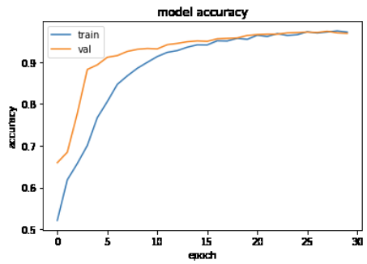  

Train vs Test Accuracy
  

  

Train vs Test Loss
  
  
### Instructions to run

*Tested On Linux Only*
- Ensure Nvidia drivers, docker, nvidia-container-toolkit/nvidia-docker2 is installed

#### Steps to Build Docker Image

`git clone https://github.com/jeffreypaul15/FinalYearProject`

`cd FinalYearProject`

`docker build -t fyp:latest .`

#### Steps to run the Docker Image

`docker run -it --name fyp_host --gpus=all -e DISPLAY=$DISPLAY -e NVIDIA_DRIVER_CAPABILITIES=compute,video,utility,display -v /tmp/.X11-unix:/tmp/.X11-unix --env NVIDIA_DISABLE_REQUIRE=1 --device=/dev/video2 --privileged --network host -v /some/path/on/host/:/workspace`

#### Test changes by running one of the videos

On Linux systems using xorg, You have to execute this once after boot to allow permissions for passing display
`xhost +`

In the container, start the webui using python3 http server

`cd /workspace/FinalYearProject/front_end`
`python3 -m http.server`

A web server is started and you can navigate to localhost:8000 in your browser, sign up and login

To run accident detection on a video

`cd /workspace/FinalYearProject/back_end/server_code/`
`python3 server.py --path /path/to/a/video`
